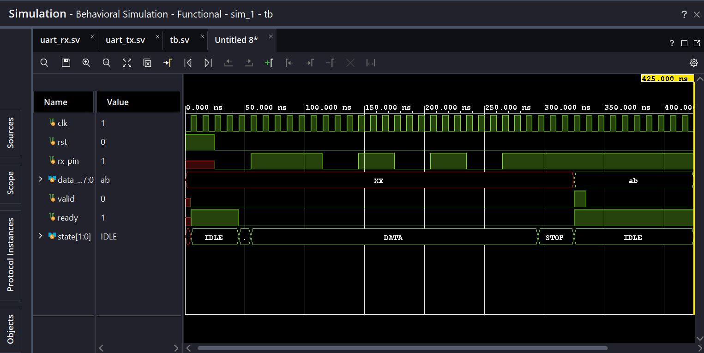
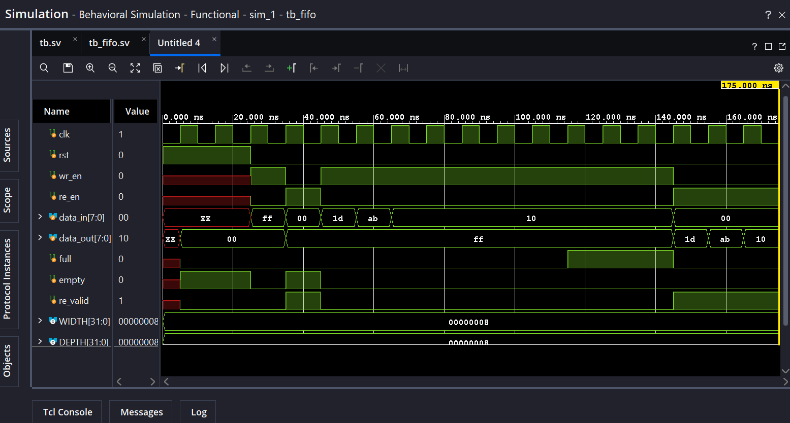
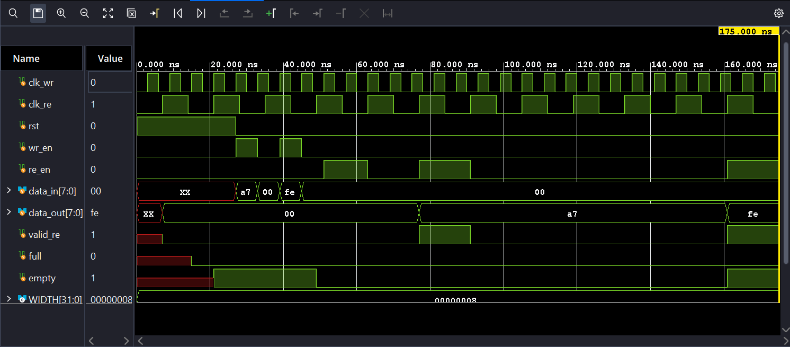

# FPGA_side_projects

Self-explanatory. just a place i can put my modules i make and side projects where i learn cool things in SV.

## UART TX/RX Transiever Project

waveform from uart_rx testbench

  

## SYNC/ASYNC FIFO design

sync fifo test bench

  

-this one was pretty fun because it was easy to stress test the design to make sure the empty/full flags were working properly.

async fifo testbench

  

- really learned a lot with this one. esp about CDC and the ingerint latency tradeoffs when deisgning an async fifo. also locked down writing testbenches (super simple ones but still useful)
